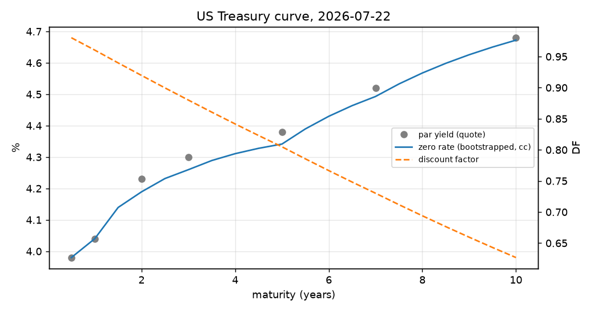

# rates-pricing-toolkit

Excel로 풀었던 금리 상품 실습과제 세 개를 Python으로 옮기고, 결과가 제 Excel 답안과 소수점 6자리까지 같은지 테스트로 확인합니다. 미 국채 zero curve, 원화 IRS 가치평가, 국고채 듀레이션·DV01·컨벡시티, Delta-Normal VaR를 다룹니다.



## 과제 개요

U.FE.A 금융공학 학회 실습과제로 Excel에서 풀었던 것들입니다. 원본은 제가 제출한 답안 파일만 썼고 강사 모범답안은 쓰지 않았습니다.

| 과제 | 기준일 | 내용 |
|---|---|---|
| UST Zero Curve Bootstrapping | 2026-07-22 | 미 국채 par yield로 할인계수와 zero rate(연속복리) 산출 |
| KRW IRS Pricing | 2026-08-05 | CD 91일과 IRS 1~5년 호가로 커브를 만들고 5년 pay-fixed IRS(계약금리 3.90%) 평가 |
| KTB Duration, Convexity, VaR | 2026-07-30 | 국고채권 04250-3606(26-6)의 가격, 듀레이션, DV01, 컨벡시티, 1일 99% VaR |

Excel은 셀마다 식을 확인하기는 좋지만 가정을 바꿔 다시 돌리거나 결과가 맞는지 자동으로 검증하기 어렵습니다. 식을 함수로 옮기고 Excel 결과를 기준값으로 테스트를 걸어 두면 둘 중 어느 쪽이 틀려도 드러납니다.

## 접근 방식

Excel과 같은 가정을 그대로 옮겼습니다. 결과가 다르면 옮기는 과정의 실수인지 Excel 쪽 문제인지 따져 보기 위해서입니다.

- **부트스트랩.** 시장 호가가 있는 만기(노드)의 할인계수를 par 조건으로 하나씩 풉니다. 노드 사이 지급일의 할인계수는 ln DF 선형(log-linear) 보간입니다. 새 노드를 풀 때 그 사이 지급일의 DF도 새 노드에 따라 바뀌므로, 보간까지 포함한 par 조건을 `brentq`로 풉니다. Excel에서는 Solver로 같은 일을 했습니다.
- **UST.** 6M과 1Y는 호가 수익률을 그대로 연속복리 zero rate로 두고, 2Y~10Y는 반기 이표 par 채권 조건 (y/2)·ΣDF + DF(T) = 1로 풉니다.
- **KRW IRS.** 0.25년 DF는 CD 91일(단리)로 정하고, 1Y~5Y는 분기 지급 par swap 조건으로 풉니다. 단일 커브(할인과 CD 선도금리 예측에 같은 커브), accrual 0.25 고정입니다.
- **국고채.** 결제일 이후 이표일마다 t = 일수/365, DF = 1/(1 + y/2)^(2t)로 할인합니다. 듀레이션과 컨벡시티는 이 현금흐름에서 직접 계산합니다.
- **VaR.** 금리 일간 변동(bp)의 표본 표준편차 × z(99%) × DV01 × √1일입니다.

## 구현

```
rates-pricing-toolkit/
├── src/ratestool/
│   ├── curve.py      par 부트스트랩(log-linear), zero rate
│   ├── ust.py        미 국채 zero curve
│   ├── irs.py        원화 IRS 커브, 3M 선도금리, pay-fixed 평가
│   ├── bond.py       이표 일정, 가격, 듀레이션, DV01, 컨벡시티
│   └── var.py        일간 변동성, Delta-Normal VaR
├── scripts/report.py     Python 결과와 Excel 답안을 나란히 출력, 그림 생성
├── tests/
│   ├── fixtures/inputs.json           과제 입력값
│   └── fixtures/excel_expected.json   Excel 답안 결과값 (기준값)
└── figures/
```

- 계산은 NumPy 배열 연산이고, 금리 라이브러리(QuantLib 등)는 쓰지 않았습니다.
- 국고채 금리 시계열(234일)은 저장소에 넣지 않았습니다. VaR 테스트는 그 시계열로 계산한 일간 변동성 4.8147bp를 입력으로 씁니다. 시계열이 있으면 `daily_vol_bp`로 같은 값을 다시 구할 수 있고, 로컬에서 Excel의 STDEV와 같은 값이 나오는 것을 확인했습니다.

## 실행 결과

`python scripts/report.py` 출력입니다.

| 항목 | Python | Excel 답안 | 차이 |
|---|---:|---:|---:|
| UST zero 2Y (%) | 4.189336 | 4.189337 | −5.3e-07 |
| UST zero 5Y (%) | 4.341417 | 4.341417 | 1.4e-07 |
| UST zero 10Y (%) | 4.672346 | 4.672346 | 2.1e-08 |
| KRW 5Y 공정 스왑금리 | 3.8325000% | 3.8324965% | 3.5e-08 |
| 고정 레그 PV (원) | 17,717,274,044 | 17,717,277,275 | −3,231 |
| 변동 레그 PV (원) | 17,410,628,916 | 17,410,616,369 | 12,547 |
| pay-fixed IRS 가치 (원) | −306,645,128 | −306,660,906 | 15,778 |
| 국고채 dirty price | 10006.269047 | 10006.269047 | 0 |
| Macaulay / Modified Duration | 8.113955 / 7.942749 | 8.113955 / 7.942749 | 0 |
| Convexity | 75.336051 | 75.336051 | 0 |
| DV01 (원, 명목 100억) | 7,947,728.23 | 7,947,728.23 | 0 |
| 1일 99% VaR (원) | 89,018,937 | 89,018,937 | 0 |

할인계수와 금리는 모든 지점에서 Excel과 1e-6 안쪽으로 같습니다(UST DF 최대 차이 9.7e-09, KRW IRS DF 최대 차이 7.0e-07). 국고채와 VaR는 식이 닫힌 형태라 완전히 같습니다.

## 결과 분석

은행이 제시한 계약금리 3.90%는 공정 스왑금리 3.8325%보다 6.75bp 높습니다. 고정금리를 내는 A사 입장에서는 계약 시점부터 약 3억 원 손해인 거래입니다.

그림에서 zero rate가 par yield보다 낮게 그려지는 것은 복리 기준이 달라서입니다. par yield는 반기 복리, zero rate는 연속복리입니다. 2Y par 4.23%를 연속복리로 바꾸면 4.186%로 zero rate 4.189%보다 조금 낮습니다. 우상향 커브에서 zero가 par보다 높다는 관계는 같은 복리 기준에서 성립합니다.

**한계.** UST 6M·1Y는 호가 수익률(bond-equivalent)을 그대로 연속복리 zero rate로 쓴 과제 가정을 따랐습니다. 복리 기준을 맞추면 단기 구간이 조금 달라집니다. IRS는 단일 커브, accrual 0.25 고정, 영업일 조정 없음으로 단순화했습니다. 실제 원화 IRS 평가에서는 할인과 예측 커브를 나누고 실제 이자 일수를 씁니다.

## 이슈 기록

**Excel Solver가 호가를 정확히 재현하지 않음.** IRS 커브를 Excel Solver로 풀었을 때 5년 par swap rate가 호가 3.8325%가 아니라 3.8324965%로 멈춰 있었습니다. Python은 모든 호가를 1e-12 안쪽으로 재현합니다. 할인계수 차이는 7e-07에 불과하지만 명목 1,000억 원에 곱해지면 IRS 가치에서 약 1.6만 원 차이가 납니다. 테스트는 금리와 DF를 소수점 6자리로, 원화 금액은 상대오차로 비교합니다.

**"최근 250영업일" 시계열이 234일.** 시작일을 WORKDAY(결제일, −250)로 잡았지만 WORKDAY는 한국 공휴일을 모르고, 실제 금리가 있는 날만 남기면 234일입니다. 표준편차는 233개 일간 변동으로 계산됩니다.

## 실행 방법

Python 3.10 이상.

```bash
pip install -e ".[dev]"
pytest
python scripts/report.py
```

그림까지 다시 그리려면 `pip install matplotlib`이 필요합니다.

## 개발 방식

과제 풀이와 Excel 답안은 직접 작성했습니다. Python 이식과 테스트, 이 README는 Claude Code로 작성했습니다.

검증은 이렇게 했습니다.

- Excel 파일에서 입력값과 결과값을 코드로 추출해 fixture로 두고, 셀 수식을 하나씩 확인하며 같은 가정으로 옮겼습니다.
- Excel과 다른 값이 나온 곳(IRS 금액)은 원인을 Solver 잔차로 확인한 뒤에 허용 오차를 정했습니다.
- Excel과 무관한 성질도 테스트합니다. 부트스트랩 커브가 모든 par 호가를 재현하는지, 공정 금리의 스왑 가치가 0인지, 단일 커브에서 변동 레그 PV가 1 − DF(T)와 같은지, 평평한 par 커브가 평평한 선도금리를 주는지입니다.

| 테스트 | 확인 내용 |
|---|---|
| `test_against_excel.py` | UST DF·zero rate, KRW IRS DF·선도금리·공정금리·레그 PV, 국고채 가격·듀레이션·컨벡시티·DV01, VaR가 Excel 답안과 일치 |
| `test_properties.py` | par 호가 재현, 공정 금리에서 가치 0, 변동 레그 = 1 − DF(T), 평평한 커브, 표본 표준편차 정의 |
